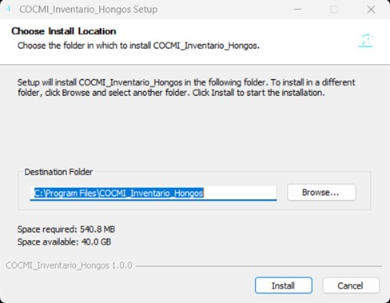
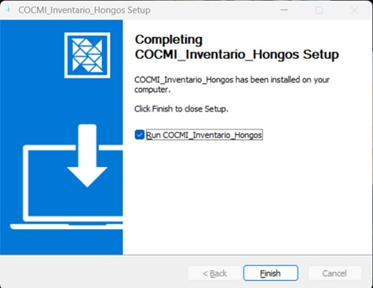

# COCMI - Sistema de Gestión de Inventario de Hongos

Este proyecto es una aplicación de escritorio desarrollada para la gestión del inventario de la colección de hongos (COCMI).


## Proceso de instalación del sistema
Una vez descargado el ejecutable COCMI_Inventaio_Hongos_Setup.exe, realizar los siguientes pasos:
1. Doble click en este.
2. Aparece una ventana pidiendo permisos para la aplicación, selecciona SI.
3. Aparece en seguida una ventana similar a esta:



4. Selecciona Instalar, esto iniciara el proceso de instalación de la aplicación, al finalizar se vera una ventana similar a esta:
 


5. Selecciona Finalizar

## 🛠️ Tecnologías Utilizadas

*   **Electron**: Framework para convertir la aplicación web en una aplicación de escritorio nativa.
*   **Frontend**: React + Vite.
*   **Backend**: Node.js + Express.
*   **Base de Datos**: SQLite (gestionada con Prisma ORM).
*   **Empaquetado**: electron-builder.

## 📂 Arquitectura de la Base de Datos (Importante)

A diferencia de una aplicación web tradicional, esta aplicación **no requiere instalar un servidor de base de datos externo** (como MySQL o PostgreSQL) ni usar Docker.

*   **Motor**: SQLite.
*   **Archivo de Datos**: La base de datos completa reside en un único archivo llamado `dev.db`.
*   **Tipos de Datos**: Para asegurar compatibilidad total con SQLite, se utilizan tipos `Float` en lugar de `Decimal` para campos numéricos como Temperatura, Humedad, pH, Latitud y Longitud.

### Ubicación de la Base de Datos

1.  **En Desarrollo**:
    *   El archivo se encuentra en: `App/backend/prisma/dev.db`.
2.  **En Producción (Ejecutable)**:
    *   Al instalar o ejecutar la aplicación, se crea automáticamente una carpeta llamada `database` **en el mismo directorio donde está el ejecutable (.exe)**.
    *   El archivo `dev.db` se guarda dentro de esa carpeta `database/`.
    *   **Portabilidad**: Para mover la aplicación y mantener los datos, debes copiar tanto el `.exe` como la carpeta `database`.

### Cómo ver/editar los datos manualmente
Para inspeccionar la base de datos fuera de la aplicación, recomendamos usar **DB Browser for SQLite** (gratuito). Simplemente abre el archivo `dev.db` con este programa.

## 🚀 Guía para Desarrolladores

> Para una guía paso a paso detallada sobre la configuración inicial y solución de problemas comunes, consulta el archivo [SETUP_GUIDE.md](../SETUP_GUIDE.md) en la raíz del repositorio.

### Prerrequisitos
*   Node.js (v18 o superior recomendado).
*   Git.

### Instalación de Dependencias

Ejecuta el siguiente comando en la carpeta raíz `App/` para instalar las dependencias del proyecto principal, frontend y backend:

```bash
cd App
npm install
cd frontend && npm install && npm install react-confirm-alert
cd ../backend && npm install
```

### Ejecución en Modo Desarrollo

Para trabajar en el código, puedes correr el frontend y backend por separado, o usar el script de electron (aunque actualmente está optimizado para producción).

1.  **Backend**:
    ```bash
    cd App/backend
    npx prisma migrate dev  # Asegura que la DB esté sincronizada
    npm run start             # O node server.js
    ```
2.  **Frontend**:
    ```bash
    cd App/frontend
    npm run dev
    ```

### 🔄 Cómo Modificar la Base de Datos (Schema)

Si necesitas agregar tablas, columnas o cambiar relaciones, sigue estos pasos:

1.  **Editar el Schema**:
    Abre el archivo `App/backend/prisma/schema.prisma` y realiza los cambios necesarios en los modelos.

2.  **Aplicar Cambios (Migración)**:
    Desde la terminal, en la carpeta `App/backend`, ejecuta:
    ```bash
    npx prisma migrate dev --name nombre_descriptivo_del_cambio
    ```
    *Ejemplo: `npx prisma migrate dev --name agregar_campo_imagen`*

    **¿Qué hace esto?**
    *   Actualiza el archivo local `dev.db` con la nueva estructura.
    *   Regenera el "Prisma Client" (la librería que usa el código para hablar con la BD).
    *   Crea un historial de migraciones en la carpeta `prisma/migrations`.
    
    *Nota*: Si encuentras errores de inconsistencia de datos o tipos (ej. al cambiar de Decimal a Float), puedes usar `npx prisma db push` para forzar la sincronización del esquema con la base de datos local.

3.  **Reconstruir el Ejecutable**:
    Una vez que la base de datos local (`dev.db`) está actualizada, al correr `npm run dist`, esta nueva versión de la base de datos se empaquetará en el instalador.

    > **⚠️ Nota Importante para Actualizaciones**:
    > Si un usuario ya tiene instalada la aplicación, su carpeta `database/dev.db` **NO se sobrescribirá** automáticamente (para no borrar sus datos).
    > Si cambias la estructura de la base de datos, los usuarios existentes deberán:
    > *   Opción A: Borrar su carpeta `database` (perdiendo sus datos) para que la app genere la nueva versión.
    > *   Opción B: Usar herramientas manuales para migrar sus datos (avanzado).
    > *   *Recomendación*: Para este proyecto académico, asuman que un cambio de esquema requiere una reinstalación limpia (Opción A).

### Cambios Recientes en el Schema (Diciembre 2025)
*   **Corrección de Tipos (Fecha)**: Se cambió el campo `Fecha` en la tabla `Colectas` de `DateTime` a `String` para soportar formatos de fecha heredados y evitar errores de conversión en tiempo de ejecución.
*   **Corrección de Tipos (Numéricos)**: Se migraron los campos numéricos de `Decimal` a `Float` en las tablas `Colectas` y `Coordenadas` para resolver errores de lectura (`P2023`) con datos preexistentes en SQLite.
*   **Nueva Relación**: Se agregó la columna `idHongo` a la tabla `Aislamientos` para permitir una relación directa entre un aislamiento y un hongo, facilitando las consultas.

### Generación del Ejecutable (Build)

Para crear el instalador de Windows (`.exe`), usa el siguiente comando desde la carpeta `App/`:

```bash
npm run dist
```

Este comando realizará lo siguiente:
1.  Construirá el Frontend (Vite build).
2.  Instalará dependencias del Backend.
3.  Empaquetará todo usando Electron Builder.

**Salida**:
*   Los archivos generados estarán en la carpeta `App/dist/`.
*   **Instalador**: `COCMI_Inventario_Hongos_Setup.exe` (sin número de versión en el nombre para facilitar actualizaciones).
*   **Versión Descomprimida**: Carpeta `win-unpacked`.

## ⚠️ Notas Importantes sobre el Código

*   **`electron/main.js`**: Es el punto de entrada. Se encarga de iniciar el proceso de Node.js del backend (`server.js`) como un subproceso y de gestionar la ventana de la aplicación. También contiene la lógica para copiar la base de datos `dev.db` a la carpeta del usuario si no existe.
*   **`backend/prisma/schema.prisma`**: Define la estructura de la base de datos. Si haces cambios aquí, debes ejecutar `npx prisma migrate dev` para aplicarlos.
*   **`frontend/vite.config.js`**: Configurado con `base: './'` para asegurar que las rutas funcionen correctamente dentro de Electron (sistema de archivos local).

# Gestión de Base de Datos (SQLite)

Este proyecto utiliza **SQLite** como motor de base de datos. A diferencia de versiones anteriores (que usaban Docker/MariaDB), ahora la base de datos es un archivo local, lo que simplifica el desarrollo y la distribución.

**¡No necesitas Docker para correr el backend!**

## 📂 Ubicación del Archivo
El archivo de base de datos se encuentra en:
`App/backend/prisma/dev.db`

## 🛠️ Comandos Comunes

### 1. Iniciar el Backend (Desarrollo)
El backend es un servidor Node.js estándar. Solo necesitas correrlo en una terminal:

```bash
cd App/backend
npm start
```
*El servidor iniciará en http://localhost:3000 y se conectará automáticamente al archivo `dev.db`.*

### 2. Ver/Editar Datos (Interfaz Gráfica)
Prisma incluye una herramienta visual para explorar la base de datos sin necesidad de instalar programas extra:

```bash
cd App/backend
npx prisma studio
```
Esto abrirá una pestaña en tu navegador donde puedes ver y editar los registros manualmente.

### 3. Aplicar Cambios al Schema (Migración)
Si modificas el archivo `schema.prisma` (agregas tablas o columnas):

```bash
npx prisma migrate dev --name nombre_del_cambio
```

### 4. Resetear Base de Datos
Si quieres borrar todo y empezar de cero (útil si hay errores de inconsistencia durante el desarrollo):

```bash
npx prisma migrate reset
```

### 5. Poblar con Datos de Prueba (Seed)
Para cargar los datos iniciales a la base de datos SQLite usando el script de seed configurado:

```bash
npx prisma db seed
```

# Cómo Construir y Ejecutar el Ejecutable

Este proyecto está configurado para empaquetarse como un ejecutable de Windows usando **Electron**.

## Prerrequisitos

- Tener **Node.js** instalado.
- Tener instaladas las dependencias en:
  - `App`
  - `App/frontend`
  - `App/backend`

## Construcción del Ejecutable

1. Abre una terminal en el directorio `App`.

2. **Importante:** Instala las dependencias primero (solo una vez):

    ```bash
    npm install
    ```

3. Ejecuta el siguiente comando para cerrar instancias de Node (por si están ocupando puertos o archivos):

    ```bash
    taskkill /F /IM node.exe
    ```

4. Luego construye el frontend, instala las dependencias del backend y empaqueta la aplicación:

    ```bash
    npm run dist
    ```

    Esto generará un instalador en la carpeta `App/dist`
    (ejemplo: `ProyectoAdminG6 Setup 1.0.0.exe`).

### Si solo quieres el ejecutable sin instalar (ideal para pruebas rápidas):

```bash
npm run pack
```

Esto generará el ejecutable en:
```bash
App/dist/win-unpacked/ProyectoAdminG6.exe
```

## Cómo Funciona
- **Electron:** Envuelve la aplicación dentro de una ventana de escritorio.

- **Frontend:** Construido con Vite (npm run build-frontend) y servido internamente por Electron.

- **Backend:** La carpeta backend se copia dentro de los recursos de la aplicación. Electron inicia el servidor (server.js) como un proceso en segundo plano al abrir la aplicación.

## ❓ Preguntas Frecuentes

**¿Por qué cambiamos a SQLite?**
Al usar SQLite, la base de datos es "portable" (es solo un archivo). Esto facilita enormemente la creación del ejecutable de escritorio (`.exe`), ya que no necesitamos pedirle al usuario final que instale un servidor de base de datos complejo.

**¿Cómo desarrollo sin Docker?**
Simplemente corre `npm start` en la carpeta `backend` y `npm run dev` en la carpeta `frontend`. Ambos procesos correrán en tu máquina local y se comunicarán entre sí.

**¿Qué pasa si quiero usar el sistema en otro equipo? ¿Cómo migro los datos?**
Sencillo. Primero, instala el sistema en el nuevo equipo siguiendo los pasos descritos anteriormente. Para conservar la información existente de la base de datos, copia el archivo dev.db, ubicado en la carpeta que contiene el ejecutable de la aplicación:
```bash
..\win-unpacked\database\dev.db
```
Posteriormente, pega este archivo en la misma ruta dentro de la carpeta del ejecutable en la nueva computadora. Dado que dicha carpeta ya contendrá un archivo dev.db generado por defecto, será necesario reemplazarlo para mantener los datos originales.

## Solución de Problemas (Troubleshooting)
- **Base de Datos:**
El backend utiliza una base de datos SQLite local (dev.db). Este archivo es manejado automáticamente por la aplicación dentro de la carpeta del backend. No se requiere instalar un servidor externo.

- **Puertos:**
El backend intenta escuchar en el puerto 3000. Si está en uso por otra aplicación, podrían aparecer errores al iniciar.

## Equipo de Desarrollo
- Alejandro Solórzano
- Antony Picado
- Isaac Vargas
- Rachit Díaz
- Kenneth Osorio

